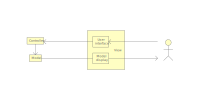
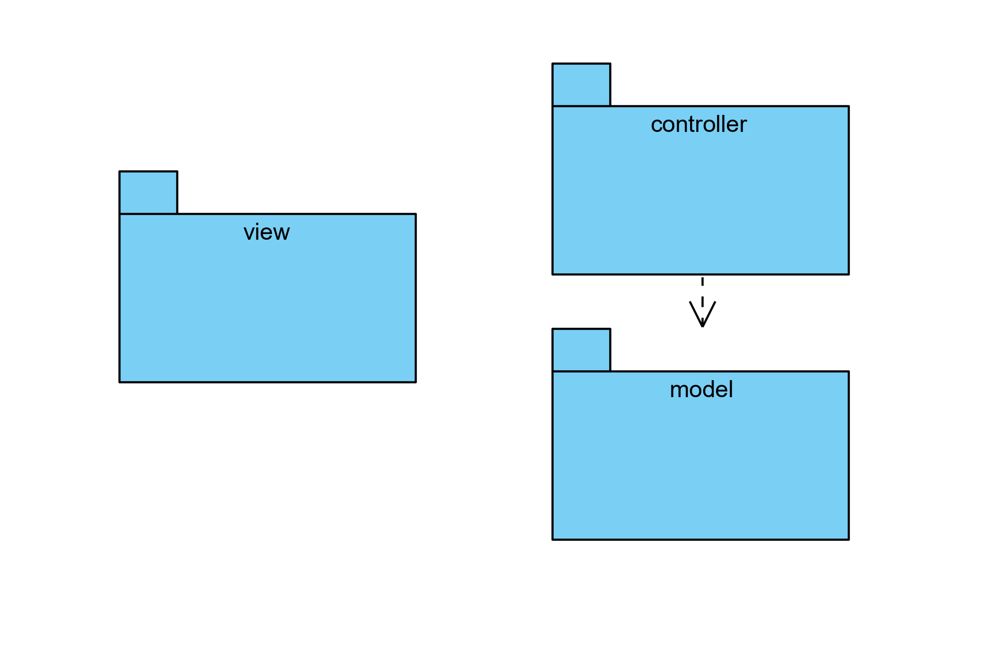
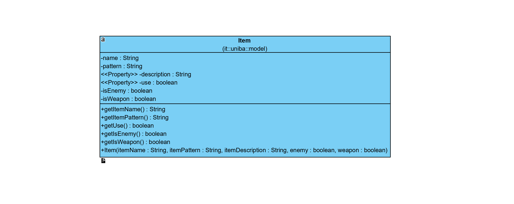
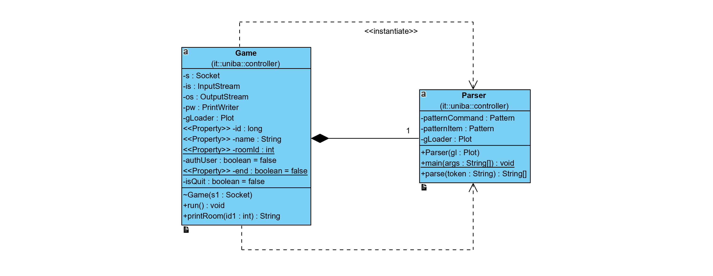
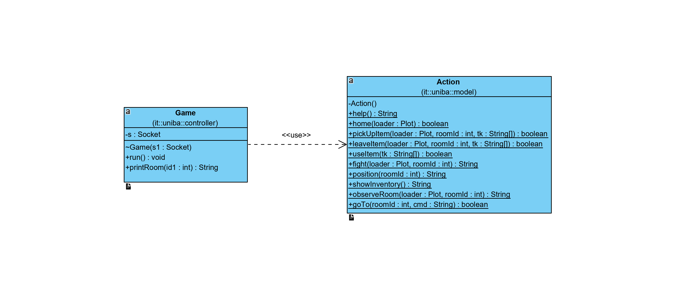
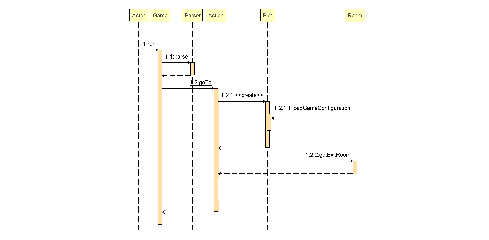

# text adventure-troika 
 
    
# Indice  

### 1. [Introduzione](#1)  
 1. [Mappa del gioco](#1.1)          

### 2. [Requisiti specifici](#2)          
 1. [Requisiti funzionali](#2.1)          
 2. [Requisiti non funzionali](#2.2)        
        
### 3. [System Design](#3)          
 1. [Stile architetturale](#3.1)          
 2. [Rappresentazione dell’architettura](#3.2)          
        
### 4. [OO Design](#4)        
 1. [Information hiding](#4.1)          
 2. [Alta coesione](#4.2)          
 3. [Basso accoppiamento](#4.3)     
 4. [Don't Repeat Yourself (DRY)](#4.4)      

### 5. [Contenuti rilevanti](#5)        
 1. [Trattamento delle eccezioni](#5.1)          
 2. [I/O da file](#5.2)          
 3. [Connessione a database](#5.3)     
 4. [GUI mediante SWING](#5.4)     
 5. [Client-server multithreading](#5.5)     

### 6. [Riepilogo del test](#6)   
 1. [Analisi statica del codice](#6.1)   
     1.1 [Checkstyle](#6.1.1)  

### 7. [Processo di sviluppo e organizzazione del lavoro](#7)  
  1. [Product backlog](#7.1)  
  2. [Strumenti di lavoro](#7.2)
       
# 1. Introduzione 

Questo documento è una relazione tecnica finale per il progetto che implementa il gioco <em>Il Labirinto di Cnosso</em> 
del gruppo Troika.
     

Lo scopo di questo progetto è quello di creare un'avventura testuale che possa essere utilizzata da utenti che abbiano 
una conoscenza almeno dilettantistica del suo funzionamento.
   

L'interfaccia utente è stata implementata sia in versione grafica <em>(Graphical User Interface - GUI)</em> sia a 
riga di comando <em>(Command Line Interface - CLI).</em>
   

Si osserva che l'obiettivo di questo progetto è quello di dimostrare le competenze acquisite durante le lezioni del   
corso di Metodi Avanzati di Programmazione, piuttosto che produrre una soluzione completa e definitiva.
    

## 1.1 Mappa del gioco 

Il gioco inizia con Tesèo posto all'esterno del labirinto, dirigendosi verso <b>Sud</b> si avrà modo di entrare nell'
<em>Ala d'ingresso</em> in cui possiamo osservare un <b>gomitolo</b>. Raccogliere ed usare il gomitolo permetterà di 
uscire automaticamente dal labirinto una volta sconfitto il Minotauro inserendo il comando <code>home</code>.

Dirigendosi verso <b>Est</b> si entra nell'<em>Ala del bivio</em>.

Andando verso <b>Sud</b> si entra nell'<em>Ala della Spada</em> dove è appunto possibile raccogliere la <b>spada</b> 
che servirà in seguito quando si incontrerà il Minotauro per sconfiggerlo. Da questa stanza è possibile soltanto tornare 
alla precedente a <b>Nord</b> da cui poi si può proseguire.

Proseguendo quindi verso <b>Est</b> si entra nell'<em>Ala del grande passo</em>.

Verso <b>Nord</b> si entra nella <em>Stanza della Battaglia</em> dove si dovrà affrontare il <b>Minotauro</b> se si è 
in possesso della spada e la si sta usando, altrimenti incontrarlo sarà letale e il gioco finirà.

A <b>Sud</b> dell'<em>Ala del grande passo</em> c'è l'<em>Ala finale</em>.

<a href="#top">Torna all'inizio</a> 

# 2. Requisiti specifici 
Questa sezione specifica tutti i requisiti per il software <em>Il Labirinto di Cnosso</em>. I requisiti si riferiscono a 
funzionalità e vincoli.     
  
## 2.1 Requisiti funzionali 
I FUR *(Functional User Requirement)* descrivono le funzionalità del software in termini di:
 - servizi che il software stesso deve fornire;
 - risposte che l’utente aspetta dal software in determinate condizioni;
 - risultati che il software deve produrre in risposta a specifici input.
 
Questa applicazione fornisce le seguenti funzionalità:  

| Requisito | Descrizione |
|--|--|
| Mostrare l'elenco dei comandi | Al comando <code>help</code> l'applicazione deve mostrare una lista di comandi, uno per riga. |
| Iniziare una nuova partita | Al Run del <code>Client</code> parte l'applicazione, nella GUI dopo aver cliccato sul button  <code>Inizia partita</code>.|
| Mostrare la posizione | Al comando <code>position</code>, l'applicazione deve mostrare il nome della stanza in cui si  trova il giocatore. |
| Muovere a Nord | Al comando <code>north</code> l'applicazione deve muovere il giocatore verso Nord, se l'uscita  non è valida è mostrato il messaggio <code>C'è un muro da questa parte!</code> e l'applicazione  rimane in attesa di un comando valido. |
| Muovere a Sud | Al comando <code>south</code> l'applicazione deve muovere il giocatore verso Sud, se l'uscita  non è valida è mostrato il messaggio <code>C'è un muro da questa parte!</code> e l'applicazione  rimane in attesa di un comando valido. |
| Muovere a Est | Al comando <code>east</code> l'applicazione deve muovere il giocatore verso Est, se l'uscita  non è valida è mostrato il messaggio <code>C'è un muro da questa parte!</code> e l'applicazione  rimane in attesa di un comando valido. |
| Muovere a Ovest | Al comando <code>west</code> l'applicazione deve muovere il giocatore verso Ovest, se l'uscita  non è valida è mostrato il messaggio <code>C'è un muro da questa parte!</code> e l'applicazione  rimane in attesa di un comando valido. |
| Prendere un articolo | Al comando <code>take</code> l'applicazione deve prendere l'articolo, porlo nell'inventario ed  eliminarlo dalla stanza, se non ci sono oggetti è mostrato il messaggio <code>In questa</code>  <code>stanza non è presente l'oggetto</code> e l'applicazione rimane in attesa di un comando  valido. |
| Usare un articolo | Al comando <code>use</code> l'applicazione deve usare le proprietà dell'articolo, se non ci  sono oggetti è mostrato il messaggio <code>Nel tuo inventario non è presente l'oggetto</code>  e l'applicazione rimane in attesa di un comando valido. E possibile usare al massimo  due articoli contemporaneamente |
| Lasciare un articolo | Al comando <code>leave</code> l'applicazione deve lasciare l'articolo nella stanza corrente,  rimuovendolo dall'inventario, se non ci sono oggetti è mostrato il messaggio  <code>Nel tuo inventario non è presente l'oggetto</code> |
| Combattere un personaggio | Al comando <code>fight</code> l'applicazione deve sconfiggere il personaggio. |
| Mostrare l'inventario | Al comando <code>inventory</code> l'applicazione deve mostrare la lista degli articoli raccolti. |
| Chiudere il gioco | Al comando <code>quit</code> l'applicazione si deve chiude e compare il prompt del sistema  operativo. |

## 2.2 Requisiti non funzionali  
I NFR *(Non Functional Requirement)* descrivono le caratteristiche di qualità del prodotto software da sviluppare, i 
requisiti di sistema/ambiente, le tecnologie e gli standard di cui il software deve tenere conto.

<table>
<thead>
  <tr>
    <th>Requisito</th>
    <th>Sottorequisito</th>
    <th>Descrizione</th>
  </tr>
</thead>
<tbody>
  <tr>
    <td rowspan="3">Usabilità</td>
    <td>Apprendibilità</td>
    <td>Il software prevede che l'utente conosca le regole generali di un'avventura testuale.</td>
  </tr>
  <tr>
    <td>Protezione dall’errore utente</td>
    <td>Il livello di protezione dagli errori dell'utente consiste nella rigorosa analisi dell'input con opportune notifiche di comandi o mosse errate.</td>
  </tr>
  <tr>
    <td>Estetica dell’interfaccia utente</td>
    <td>Il software implementa una GUI in cui i comandi principali sono rappresentati da dei buttons. La gradevolezza dell’uso dell’interfaccia utente è garantita da uno profondo studio dei simboli su diverse tipologie di OS.</td>
  </tr>
  <tr>
    <td rowspan="3">Manutenibilità</td>
    <td>Modularità</td>
    <td>Il software è creato utilizzando le best practices del linguaggio OO Java ed è suddiviso secondo l'architettura MVC in modo che le modifiche abbiano un minimo impatto sulle altre componenti.</td>
  </tr>
  <tr>
    <td>Riusabilità</td>
    <td>Il software è progettato in modo da poter essere utilizzato per l'implementazione di altri giochi simili aggiungendo nuovi comandi e azioni.</td>
  </tr>
  <tr>
    <td>Testabilità</td>
    <td>Alcune classi sono provviste del proprio <code>main</code> per poter essere eseguite e testate autonomamente (es. <code>Client</code>, <code>Server</code> ...)</td>
  </tr>
  <tr>
    <td rowspan="4">Portabilità</td>
    <td>Adattabilità</td>
    <td>La larghezza dello schermo prevede un minimo di 80 caratteri.</td>
  </tr>
  <tr>
    <td>Installabilità</td>
    <td> Il pacchetto JDK 11 è installabile sui sistemi operativi Windows NT, macOS, Linux e Oracle Solaris.</td>
  </tr>
</tbody>
</table>  
<a href="#top">Torna all'inizio</a>

# 3. System Design 
Questa sezione si occupa dell'identificazione dei principali componenti e delle relazioni tra questi, definendo un 
modello compatto del modo in cui il sistema è strutturato. 

## 3.1 Stile architetturale
Questo software e la sua interfaccia utente possono essere interpretati come un **MVC** 
*(Model-View-Controller)*, un modello architettonico che isola l'amministrazione del gioco (business logic - Model), 
dalla presentazione dei dati (View).

>_Diagramma del funzionamento di un'architettura MVC._

 
 

Il <b>View</b> si occupa dell'interazione con utenti e agenti, e mostra i dati contenuti nel Model come la descrizione 
delle stanze o l'inventario.

Il <b>Controller</b> riceve i comandi dalla tastiera (attraverso il View) o tramite buttons e avvia una risposta 
effettuando chiamate sugli oggetti del Model e modificando lo stato degli altri due componenti.

Il <b>Model</b> fornisce i metodi per accedere ai dati del dominio su cui opera l'applicazione, come le informazioni 
sulla posizione corrente del giocatore.

## 3.2 Rappresentazione dell’architettura 

>_Diagramma dei package di uniba._

 

Il <code>Package controller</code>, che si occupa di avviare una partita per ogni connessione del <code>Client</code> al
<code>Server</code> e verificare l'input ricevuto dall'utente, ha una dipendenza diretta con il <code>Package model</code>
per permettere:
 
 - di istanziare gli elementi di un <code>Game</code> come una <code>Room</code> o un <code>Item</code>;
 
 - che specifici comandi della <code>Plot</code> estratti da un dato file YAML siano o meno validi attraverso il 
 <code>Parser</code>;

 

Il <code>Package view</code> è totalmente indipendente dalla gestione delle richieste dell'utente, la selezione 
della risposta e l'implementazione delle funzionalità degli oggetti.

 

<a href="#top">Torna all'inizio</a>

# 4. OO Design  
Questa sezione specifica attraverso riferimenti diretti alle <em>user story</em> più significative, che identificano le 
decisioni di progetto, in che modo è stato applicato l’OO Design <em>(Object Oriented Design)</em> all’interno
del software.

## 4.1 Information hiding        
Per il principio di *information hiding* ogni componente deve custodire dei segreti al proprio interno per
salvaguardare la propria integrità e correttezza. 

Questo è permesso grazie a classi composte generalmente da attributi e metodi privati che favoriscono l'incapsulamento 
dei dati).

Solo i metodi strettamente necessari all’interazione con altre classi sono pubblici, nonché i metodi
<code>get</code> e <code>set</code>, per un accesso sicuro e salvaguardato agli attributi della classe dall’esterno.
 
 

>_Diagramma di classe di <code>Item</code>._

 
La classe <code>Item</code> ne è un esempio poichè contine attributi privati a cui sono annessi metodi <code>get</code>
e <code>set</code> pubblici per l'accesso e l'impostazione dei valori.

Con questo principio l'applicazione ci permette di isolare le modifiche dovute a scelte progettuali o
correzioni di bug, senza compromettere le classi esterne a quella in questione.

## 4.2 Alta coesione 
Il concetto di coesione rappresenta il grado di dipendenza tra elementi di uno stesso componente.

Un componente ad alta coesione ha una responsabilità ben definita, che ne favorisce la:
 - riutilizzabilità;
 - manutenibilità;
 - verificabilità;
 - leggibilità → coaudiuvata dall'utilizzo del tool <em>Checkstyle</em> per la verifica della conformità del codice alle 
 regole di codifica.
    
Il manifesto di questo principio si trova all’interno della classe <code>Parser</code>, a cui è delegata la 
responsabilità di decifrare la tipologia di input a prescindere dal contesto di gioco. 
 
 

>_Diagramma delle classi per la decodifica di un input._

 

Questo diagramma delle classi mostra la relazione tra la classe <code>Game</code> (che riceve l'input utente) e la
classe <code>Parser</code> a cui verrà passato l'input ricevuto sotto forma di stringa, e che ne verificherà
la validità intercettando comandi e/o item.

La scelta di avere un componente specifico per esaudire tale necessità, rende la decodifica dell’input più compatta e
ottimizzata. A questo si aggiunge una maggiore leggibilità ed estensibilità del codice.

## 4.3 Basso accoppiamento  
L’accoppiamento misura il grado di dipendenza tra componenti diversi.

Un basso accoppiamento fa si che un cambiamento ad un componente non si propaghi su altri
componenti.

>_Diagramma delle classi di <code>Game</code> e <code>Action</code>._

La scelta progettuale di delegare ad una classe apposita <code>Action</code> la realizzazione dei comandi dati 
in input dall'utente e gestiti dalla classe <code>Game</code> rende le classi indipendenti reciprocamente, facendo sì
che la modifica, la manutenzione e la correzione di una classe non interessino l'altra.
 
 
 

## 4.4 Don't Repeat Yourself (DRY) 
Il principio DRY <em>(Don't Repeat Yourself)</em> prevede che ogni parte significativa di una funzionalità dovrebbe 
essere implementata in un unico posto del codice sorgente, evitando sequenze d'istruzioni uguali fra loro.

Una rappresentazione di questo impiego si può osservare attraverso il diagramma di sequenza che descrive
l’utilizzo del metodo <code>goTO</code> all’interno della <em>user story</em> del movimento in qualsiasi direzione.
 
 

>_Diagramma di sequenza di <code>goTo</code>._

 

Il metodo <code>goTo</code> effettua il controllo che dalla stanza corrente sia possibile muoversi nella direzione
richiesta dall'utente. Essendo la stanza corrente e la direzione passati come parametri, il metodo resta invariato a 
prescindere da quale sia la direzione. Di conseguenza, stando al principio <b>DRY</b>, il 
metodo non viene clonato, andando potenzialmente incontro ad errori di <em>copy and paste</em>, bensì è scritto una sola 
volta, rendendo il codice più leggibile, snello e facilmente manutenibile.

<a href="#top">Torna all'inizio</a>
 
# 5. Contenuti rilevanti 

## 5.1 Trattamento delle eccezioni

## 5.2 I/O da file

## 5.3 Connessione a database

## 5.4 GUI mediante SWING

## 5.5 Client-server multithreading

# 6. Riepilogo del test 
Questa sezione espone i risultati e le modalità con cui è stato testato il software.
## 6.1 Analisi statica del codice

L'analisi statica del codice è l'analisi del software che viene eseguita senza l'esecuzione del programma. 
In questo caso l'analisi viene eseguita da strumenti automatizzati.

### 6.1.1 Checkstyle
Il tool di *Checkstyle* ha permesso di scoprire e correggere violazioni dello stile di programmazione. 
  
Tutte le violazioni sono state risolte nelle classi del <code>main</code>   

  
>_Risultato di Checkstyle del main._

  
# 7. Processo di sviluppo e organizzazione del lavoro
Questa sezione descrive i metodi e la dinamica per lo sviluppo del software.

### 7.1 Product backlog

>_Parte della product backlog del gruppo Thacker._ 

La product backlog di questo gruppo è stata modificata dinamicamente,
sprint dopo sprint, con l'aggiunta di **user stories** in base alle richieste del committente.
Le _user story_ sono un tipo di oggetto limite che facilitano la sensibilizzazione 
e la comunicazione: aiutano, quindi, l'organizzazione dei team,
la loro comprensione del sistema e del suo contesto.

**N.B.:** non tutte le _user story_ della product backlog 
sono state implementate, dando la priorità a quelle previste per gli _sprint goal_.

## 7.2 Strumenti di lavoro
Questo gruppo ha utilizzato principalmente l'hub di collaborazione [Microsoft Teams](https://www.microsoft.com/it-it/microsoft-365/microsoft-teams/group-chat-software?&ef_id=CjwKCAjwtqj2BRBYEiwAqfzur0-16AYE21Zo35HZJYxTFy1__i_I2fgJjivVgf8EXDfD9K-1gHHbrRoCUIkQAvD_BwE:G:s&OCID=AID2001446_SEM_CjwKCAjwtqj2BRBYEiwAqfzur0-16AYE21Zo35HZJYxTFy1__i_I2fgJjivVgf8EXDfD9K-1gHHbrRoCUIkQAvD_BwE:G:s)
e la piattaforma di sviluppo software [GitHub](https://github.com/) 
per condividere il lavoro tra gli sviluppatori del prodotto.
GitHub, infatti, è stato utilizzato per il Version Control per gestire il controllo del lavoro da remoto,
adattandosi dunque alle restrizioni dovute all'emergenza CoVid-19;
di notevole importanza, inoltre, è stato il tool di [GitHub Actions](https://github.com/marketplace?type=actions), 
il cui compito è stato quello di automatizzare il workflow development relativo al prodotto da realizzare.
Tutti i membri del gruppo hanno utilizzato di comune accordo l'ambiente di sviluppo 
[IntelliJ IDEA](https://www.jetbrains.com/idea/).

>_Esempio di workflow automatizzato con GitHub Actions._

<em>Grazie per l'attenzione e l'opportunità,  
 a nome del gruppo Troika.</em>
 
 
<a href="#top">Torna all'inizio</a> 

