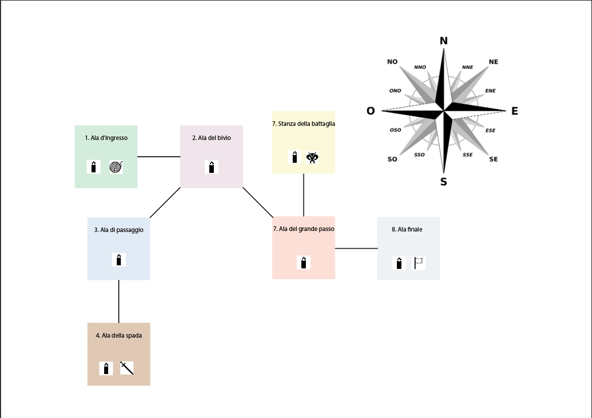

# IL LABIRINTO DI CNOSSO: l'impresa di Tesèo contro il Minotauro  

Sull’isola di Creta, nel periodo del regno di Minosse, che sposa Pasifae, in seguito ad un’offesa fatta ad Afrodite 
nasce un figlio mostruoso, metà uomo e metà toro, il Minotauro. Minosse lo imprigiona in un labirinto e, per sfamarlo, 
impone alle città sotto la sua dominazione un tributo annuale di sette fanciulle e sette fanciulli. Un anno, però, tra 
loro viene condotto il principe di Atene, Tesèo, che non vuole arrendersi al tragico destino e tenterà di sconfiggere il
letale mostro...      Il gioco inizia con Tesèo posto all'esterno del labirinto, 
dirigendosi verso **Sud** si avrà modo di entrare nell'*Ala d'ingresso* in cui possiamo osservare una **candela** ed un 
**gomitolo**. Raccogliere ed usare la **candela** servirà al giocatore per ricevere informazioni più dettagliate sulla 
posizione del suo obiettivo. In questo momento l'obiettivo del giocatore è raccogliere ed usare il **gomitolo** che gli 
permetterà di uscire facilmente dal labirinto una volta sconfitto il Minotauro.  Dirigendosi verso **Est** si 
entra nell'*Ala del bivio* dove è possibile raccogliere un'altra **candela** in quanto cambiando stanza ognuna cessa il 
suo potere di indicare la strada.  Andando verso **Sud-Ovest** si entra nell'*Ala della Spada* dove è appunto 
possibile raccogliere la **spada** che servirà in seguito quando si incontrerà il Minotauro a sconfiggerlo. Inoltre è 
presente la solita **candela** che a questo punto ci indicherà la direzione del Minotauro, se la **spada** è stata 
raccolta, oppure ci consiglierà di raccogliere la **spada**. Da questa stanza è possibile soltanto tornare alla 
precedente inserendo **Nord-Est** da cui poi si può proseguire il cammino.  Proseguendo quindi verso **Sud-Est**
si entra nell'*Ala del grande passo* in cui possiamo raccogliere sempre la nostra **candela** suggeritrice. in questo 
momento se la **spada** è stata raccolta ci indicherà di proseguire verso nord per andare a sconfiggere il temuto 
Minotauro, altrimenti ci indicherà di tornare indietro per raccogliere la **spada**.  Verso **Nord** si entra 
nella Stanza della Battaglia dove si dovrà affrontare il **Minotauro** se si è in possesso della **spada**, altrimenti 
incontrarlo sarà letale e il gioco finirà. Se invece prima di incontrarlo, pur non avendo la **spada**, è stata raccolta
la **bandiera** la si può utilizzare come simbolo di resa e il gioco continuerà.  La magica **bandiera** si 
trova esattamente ad **Est** dell'*Ala del grande passo*, in particolare nell'*Ala finale* che ospita anch'essa una 
**candela**.  Se il **gomitolo** non è stato raccolto ed usato all'inizio della partita tutte le candele che si 
incontreranno dopo aver sconfitto il Minotauro porteranno verso l'uscita.
